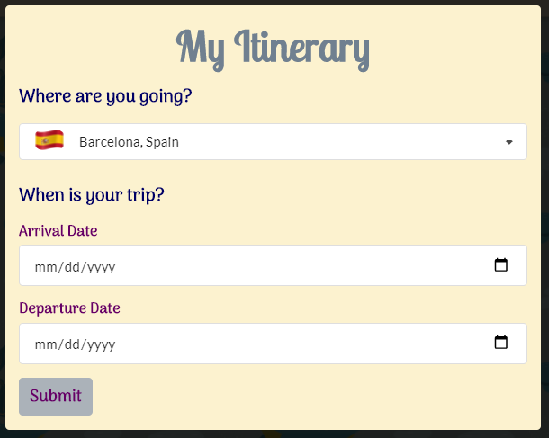

<!-- Flag icons sourced from : https://www.countryflags.com/en/ -->
# Trip Planner
* View the [Github Repo](https://github.com/girmaD/Trip-Planner/tree/main)
* View the [Deployed Application](https://girmad.github.io/Trip-Planner/)
## Table Of Contents
* [Introduction](#Introduction)
* [Objective](#Objective)
<!-- * [Snap shot of the UI](#snap-shot-of-the-UI) -->
* [How To Use The App](#How-To-Use-The-App)
* [Technologies Used](#Technologies-Used)
* [API's Used](#API's-Used)
* [Contact](Contact)

## Introduction
Planning a trip is not an easy task. Getting reliable information of activities and restautants at a given city eases some of the headaches with planning trips. Studies show that most people plan their stay on their way to their trip. Isn't it better if a user is given an application that provides activities, restaurants for a given city as well as a weather icon showing what kind of weather awaits a user on each day of his/her stay. Our Application does exactly that!

This application presents a trip planner. It provides a user with an important information to plan his/her trip. A user selects the city of his/her choosing from the option of cities provided and specifies the dates of his/her arival and departure to that city. The application renders an option for the user to add activities and/or restaurants in all the days of his/her stay. The application also presents a weather icon for each day of the stay - paving the way for the user to choose either indoor or outdoor activities depending on the weather. In a rainy day, a user may choose indoor activities from an array of avtivities rendered by the application.

This app runs in the browser and feature dynamically updated HTML and CSS powered by jQuery. jQuery's ajax method is used to send API requests to openweatherdata.org and Triposo api. Weather information is requested from  openweathermap api. Activities and restaurants information is requested from triposo api.

## Objective

The objective of this application to create a trip planner application that provides information about a range of activities and restaurants for a city of a user's choosing from city options provided as well as to provide weather conditions so that a users takes weather condition in to account when choosing activities.

## How To Use The App

A user can use this application in the following ways:
1. A user start by picking a city for his/her trip - as shown below:

2. A user then selected the arrival and departure dates to the selected city - as shown below:

3. After selecting a city and specifying arrival and departure dates for the city - a user need to submit to proceed to the next page.

4. A card that shows weather icons for each day of a user's stay with buttons to add activities and restaurants will be displayed - as shown below:

5. A user can click ADD ACTIVITIES and ADD RESTAURANTS buttons to add activities and restaurants on the days of his/her stay. Clicking either of the buttons brings a list of its respective activities and restaurants to choose from. A user then can add an activity or restaurant of his/her choosing on the days of his/her stay.
A user will have the following screen after adding both activity and restaurant on his typical trip day.

A user can add as many activities and restaurants he/she can on his/her trip day.

Happy Trip!

## Technologies Used

- HTML
- CSS
- Semantic-UI
- javaScript
- jQuery
- day.js

## API's Used

- Triposo Api - to get information on activities and restaurants.
- openweathermap Api - to get information on weather conditions.

## Contact

Should you have any questions about this repo or the deployed page, contact any of us

- Kristine Horton at [kristinehrtn@yahoo.com](mailto:kristinehrtn@yahoo.com)
- April Yang  
- Christina Engelhardt at [cjengelhardt@gmail.com](mailto:cjengelhardt@gmail.com)
- Girma Ebssa at [girma.derib@gmail.com](mailto:girma.derib@gmail.com)

