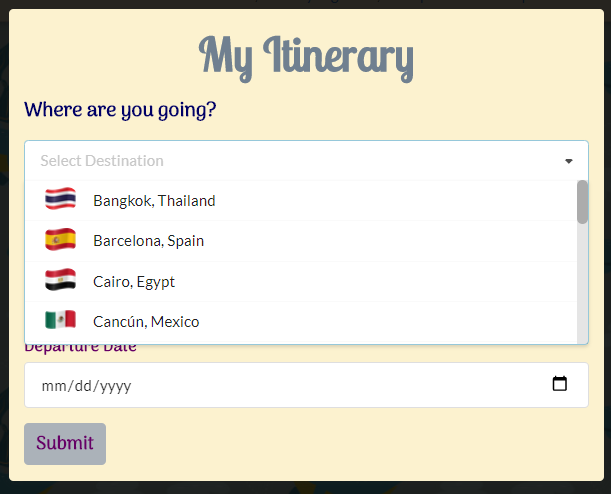
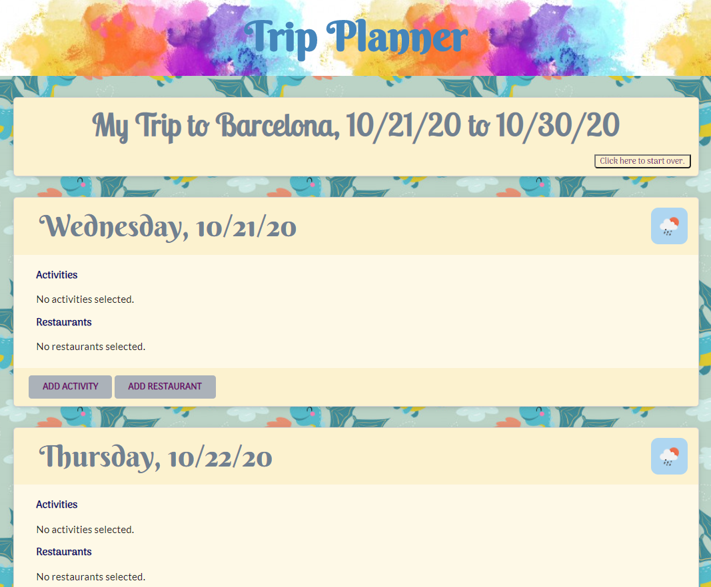

<!-- Flag icons sourced from : https://www.countryflags.com/en/ -->
# Trip Planner
* View the [Github Repo](https://github.com/girmaD/Trip-Planner/tree/main)
* View the [Deployed Application](https://girmad.github.io/Trip-Planner/)
* View the [Presentation Slides](https://docs.google.com/presentation/d/14yzWKX24n7O9447GKuaL9KPIT-f9MpDyD-6vGLKPp38/edit#slide=id.g29f43f0a72_0_0)

## Table Of Contents
* [Introduction](#Introduction)
* [Objective](#Objective)
* [How To Use The App](#How-To-Use-The-App)
* [Technologies Used](#Technologies-Used)
* [API's Used](#API's-Used)
* [Contact](Contact)

## Introduction
Planning a trip is not an easy task. Getting reliable information of activities and restaurants at a given city eases some of the headaches with planning trips. Instead of using one website to find things to do and another to find places to eat, wouldn't it be easier to have both in one location? And it would be even better if a user is given an application that provides access to activities and restaurants as well as a weather icon showing what kind of weather to expect on each day of their stay. Our Application does exactly that!

This application presents a trip planner, providing a user with a way to find and store important information to plan their trip. On their first visit, they select a destination from the list of cities provided and specifies the dates of their arrival and departure to that city. The application renders a "card" for each day to hold the points of interest they decide to store, and presents a weather icon for each day of the stay - paving the way for the user to choose either indoor or outdoor activities depending on the weather. (For example, on a rainy day, a user may want to choose more indoor activities.) Each card has an option for the user to search for activities and/or restaurants to help plan and track what they wanted to do on each day of their stay. 

This app runs in the browser and features dynamically updated HTML and CSS powered by jQuery. jQuery's AJAX method is used to send API requests to [OpenWeatherMap.org](https://openweathermap.org/) and [Triposo.com](https://www.triposo.com/api/). Weather information is requested from OpenWeather's API, while activity and restaurant information is requested from Triposo's API. 

## Objective

The objective of this application to create a trip planner application that provides information about a range of activities and restaurants for a city of a user's choosing as well as to provide weather conditions so that they can take weather condition in to account when choosing activities.

## How To Use The App

A user can use this application through the following steps:
1. They start by picking a city for their trip - as shown below:

2. A user then selects the arrival and departure dates to the selected city - as shown below:

3. After selecting a city and specifying arrival and departure dates for the city - they need to submit the form to proceed to the next page.

4. A card that shows weather icons for each day of a user's stay with buttons to add activities and restaurants will be displayed - as shown below:

5. A user can click ADD ACTIVITIES and ADD RESTAURANTS buttons to add activities and restaurants on the days of their stay. Clicking either of the buttons brings a list of choices in that category. A user then can add an activity or restaurant of their choosing on the days of their stay.

6. A user will have the following screen after adding both an activity and restaurant on a trip day. 

There is no limit in the program to how many activities or restaurants can be saved to a single day.

7. Specific activities can be removed by clicking the "X" button next to their title, or the entire plan can be reset by clicking the button on the page's header.

Happy Trip!

## Technologies Used

- Semantic-UI
- Day.js
- jQuery
- JavaScript
- CSS
- HTML

## API's Used

- [Triposo API](https://www.triposo.com/api/) - to get information on activities and restaurants.
- [OpenWeather API](https://openweathermap.org/) - to get information on weather conditions.

## License
- MIT

## Contact

Should you have any questions about this repo or the deployed page, contact any of us

- Kristine Horton - [kristinehrtn@yahoo.com](mailto:kristinehrtn@yahoo.com)
- April Yang - [aprilyanggarwood@gmail.com](mailto:aprilyanggarwood@gmail.com) 
- Christina Engelhardt - [cjengelhardt@gmail.com](mailto:cjengelhardt@gmail.com)
- Girma Ebssa - [girma.derib@gmail.com](mailto:girma.derib@gmail.com)
